gbm: gradient boosted models
----------------------------

[](https://travis-ci.org/gbm-developers/gbm)
[](https://cran.r-project.org/web/packages/gbm/)
[](https://coveralls.io/github/gbm-developers/gbm?branch=master)

Originally written by Greg Ridgeway, added to by various authors,
currently maintained by Harry Southworth.  Development is discussed
--- somewhat --- at https://groups.google.com/forum/#!forum/gbm-dev .

Non-production releases (bug fixes, mostly) will be released via the GitHub
release workflow. To install from GitHub, first install `devtools` from CRAN:

```R
install.packages("devtools")
```

Then install `gbm` from GitHub:

```R
library("devtools")
install_github("gbm-developers/gbm")
```

Note that we are currently in the middle of a fairly major tidy up, so
you should worry a bit about this code here...

# C++ design 

# Overview of the system
The R GBM package allows users to train gradient boosting machines primarily for the purposes of prediction and feature selection.  The package is built using RCpp and is composed of two parts: a R front-end that takes user inputs and performs pre-processing before passing a series of arguments to the second part; the C++ back-end.  The main algorithmic work is done in the C++ layer, which on completion passes R objects back to the R front-end for postprocessing and reporting.  This design document focusses on the C++ back-end, providing descriptions of its scope, functionality and structure; for documentation on the R API please see the R GBM package vignettes.  


## System Scope
The C++ back-end, from here on referred to as the "system", provides algorithms to: train a GBM model, make predictions on new data using such a fitted model and calculate the marginal effects of variable data within such a fitted model via "integrating out" the other variables.  The main bulk of the C++ codebase focusses on the training of a GBM model, tasks involved in this process include: set-up of datasets, calculation of model residuals, fitting a tree to said residuals and determining the optimal node predictions for the fitted tree.
The other pieces of functionality, that is prediction and calculating the marginal effects of variables, are singular functions with little or no developer designed classes associated with them.  

## Goals
The structure imposed on the C++ back-end was selected to:

* Replace a legacy setup with one more amenable to change. 
* Make the structure and functionality of the system more transparent via appropriate OO design and encapsulation.
* Implement design patterns where appropriate - in particular to simplify memory management through the application of the RAII idiom.

# 1 - Role of the system in the GBM package
Within the GBM package the system performs the main algorithmic calculations. 
It undertakes all of the algorithmic work in training a gradient boosted model, making prediction based on new covariate datasets and calculating the marginal effects of covariates given a fitted model. It does not perform any formatting or postprocessing beyond converting the fitted trees, errors etc. to a R list object and passing it back to the front-end.  

# 2 - Viewpoints of the system
Due to algorithmic nature of the system, the description of the system will focus on the behaviour of the system and its structure is captured by the Functional and Development views respectively.  Within the package the system is located in the `/src` directory.  To conclude this introduction, it should be noted that the system has been developed in line with Google C++ style.

## 2.1 - Main Use Cases
The main use cases of the system are:

* Training a gradient boosted model using data and an appropriate statistical model.
* Predicting the response from new covariates using a trained model.
* Calculating Marginal effects of data using a trained model.

## 2.2 - Functional View - Behaviour of the system
The system is composed of numerous classes used almost exclusively for training along with an interface to the R front-end.  This entry point is appropriately named `gbmentry.cpp` and contains 3 functions: gbm, gbm_pred and gbm_plot. These functions perform the training, prediction and marginal effects calculations described in Section 2.1 respectively.  The functionality and dynamic behaviour of these methods will now be described. 

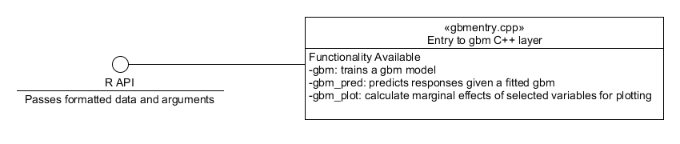
**Figure 1.** Component diagram showing the interface between the R layer and the system.


### 2.2.1 Training a GBM model
The procedure to train a gbm model follows a sequence of simple steps as shown in Figure 2. Upon entry to the gbm method the user specified parameters are converted to an appropriate GBM configuration objects, see `datadistparams.h` and `treeparams.h`.  These configuration objects are then used to initialize the GBM engine, this component stores both the tree parameters, which define the tree to be fitted, and the data/distribution container.  Upon initialization the GBM engine will also initialize an instance of an appropriate dataset class, a bagged data class and a distribution object from the GBM configuration object.  The dataset object contains both the training and validation data; these sets live together in vector containers and to swap between them the pointer to the first element in the set of interest is shifted by the appropriate amount.  The bagged data class defines which elements of the dataset are used in growing an individual tree; how these elements are chosen is distribution dependent.  After this, the GbmFit object is initialized. This object contains the current fitted learner, the errors associated with the fit and the function estimate (a Rcpp numeric vector).  The function estimate is set to the previous estimates if provided or an appropriate value for the distribution selected otherwise.    

With the GBM engine and the fit object initialized, the algorithm loops over the number of trees to fit and performs the following actions:

1. Create a tree object using .
2. Bag the data to use for fitting the tree.
3. Calculate the residuals using the current estimate, bagged data and distribution object.
4. Fit the tree to the calculated residuals - this is done by generating all possible splits for a subset of variables and choosing the split to minimize the variance of the residuals within nodes. The best splits for each node are cached so if a node is not split on this round, no future splitting of that node is evaluated.
5. Set the terminal node predictions which minimize the error.  
6. Adjust the tree, so non-terminal nodes also have predictions.
7. Update the estimate, for both training and validation sets, and calculate the: training errors, validation errors and the improvement in the out of bag error from the update. 
8. Wrap up the fitted tree and errors, along with a reference to the dataset, in a FittedLearner object (see `FittedLearner.h`).

The returned fitted learner object defines the "current fit" in the GbmFit object, which is used to update the errors. 
At the end of a single iteration, the tree and the associated errors are converted to a R List representation which is then output to the R layer once all the trees have been fitted.

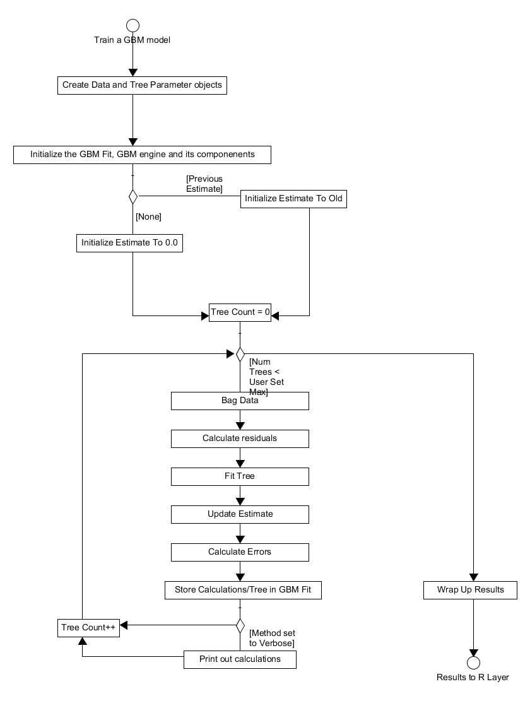
**Figure 2.** Activity diagram for the process of training a GBM model.

The bagging of the data from the training set and calculation of residuals is distribution dependent and so is incorporated in the system as appropriate methods in the distribution class and its container. The tree object is comprised of several components, the principle ones are: a root node, a vector of the terminal nodes and a vector mapping the bagged data to terminal nodes. A node splitter which generates and assigns the best potential split to each terminal node is used in the tree growing method.  This structure is shown below in Figure 3.

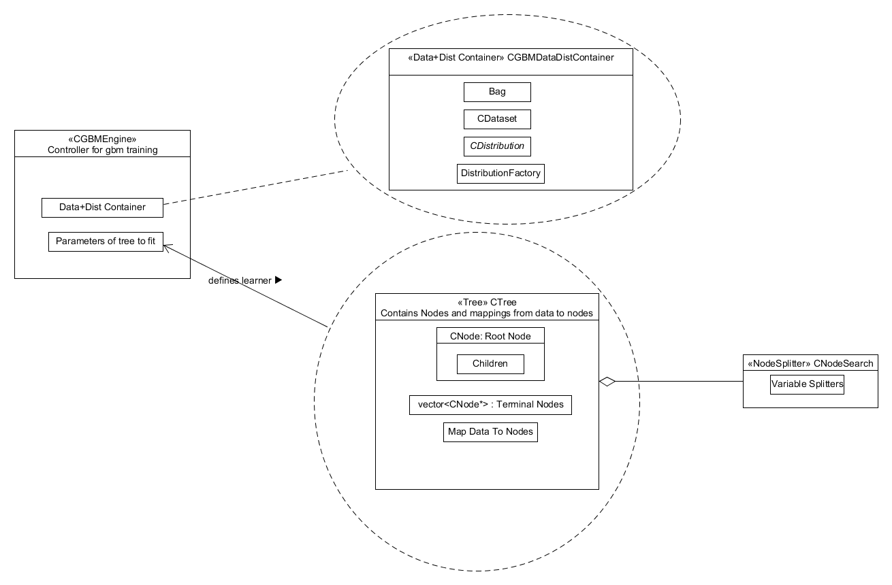
**Figure 3.** Component diagram showing what the GBM Engine component is comprised of.

### 2.2.2 Predicting from a GBM model
Using a previously fitted GBM model, the system can predict the response of further covariate data. The R frontend passes the following variables to the `gbm_pred` function in `gbmentry.cpp`: the covariates for prediction, the number of trees to use to predict, the initial prediction estimate, the fitted trees, the categories of the splits, the variable types and a bool indicating whether to return the results using a single fitted tree or not.  

The prediction for the new covariates is then initialized, either to the previous tree prediction or the initial estimate value from the model training if it is the first tree prediction to be calculating.  The number of trees to be fitted is then looped over, within each iteration the observations are in the covariate dataset are also looped over.  Each observation is initially in the root node, a counter which tracks the current node the observation is in is thus set to 0. This observation is then moved through the tree, updating its current node, until it reaches the appropriate terminal node.  Once the algorithm reaches a terminal node, the prediction for that observation and tree is set to the final split value of the terminal node's parent in the tree.  This process is repeated over all observations and for all trees, once completed the prediction vector is wrapped up and passed back to the R front-end, see Figure 4. 

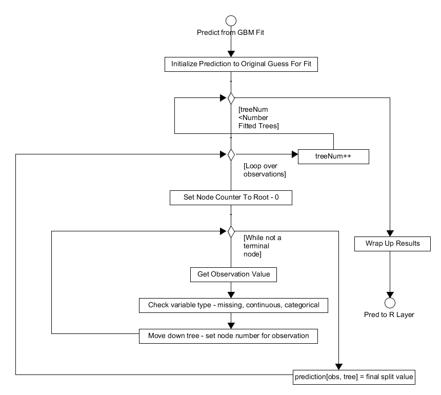
**Figure 4.** Activity diagram showing how the algorithm performs predictions on new covariate data.

### 2.2.3 Calculating the marginal effects of a variable
The final piece of functionality offered by the system is to calculate the marginal effects of a variable by "integrating" out the others.  As well as a fitted gbm model and covariate data the user also specifies which variables they're interested in at the R layer. This method utilises a `NodeStack` class which is defined at the beginning of `gbmentry.cpp`, this is a simple class that defines a stack of pairs.  These pairs contain the node index, that is what node in the tree we are looking at, and its weight.  

With this in mind the method works as follows:

1. the initial prediction is set to user specified initial values.
2. the algorithm loops over the number of trees to fit.
3. the algorithm then loops over the observations.
4. in the observation loop it creates a root node, puts it on the stack and sets the observation's current node to be 0 with weight 1.0.
5. it gets the top node off the stack and checks if it is split.
6. (a) if it isn't split the predicted function for this variable and tree is set to the split value times the weight of the node.
6. (b) if the node is non-terminal it checks if the split variable is in the user specified variables of interested.  If so the observation is moved to the appropriate child node which is then added to the stack. If this is not the case, two nodes (an average of both left/right splits - this "integrates" out the other variables) are added to the stack and it returns to step 5.  
7. When the observation reaches a terminal node it gets another observation and repeats steps 5 & 6.
8. With all trees fitted the predicted function is wrapped up and output.


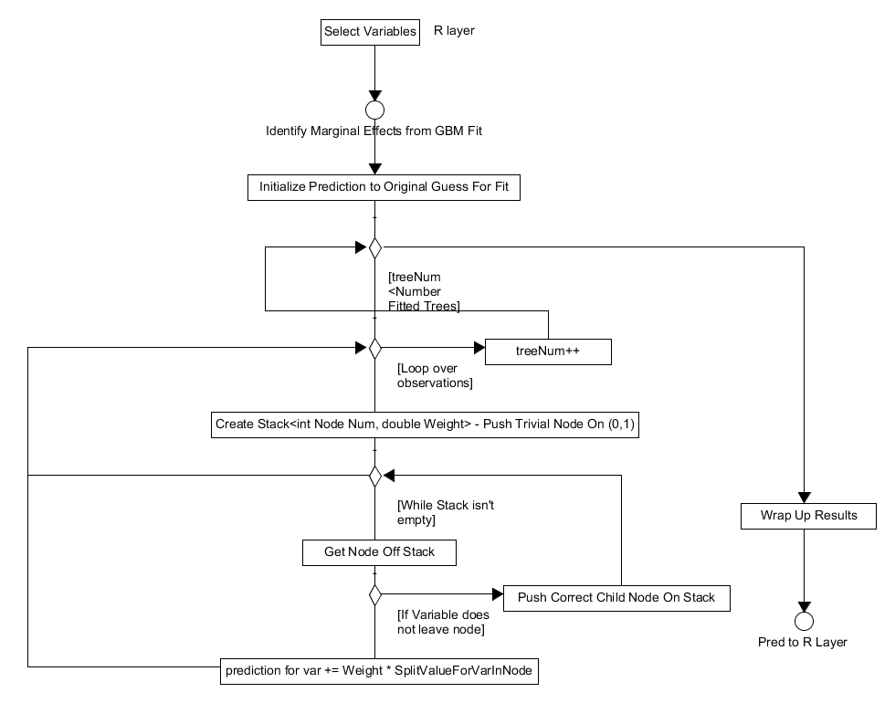
**Figure 5.** Activity diagram for calculating the marginal effects of specific variables.

## 2.3 - Structure of the system
The near entirety of the system is devoted to the task of training a gbm model and so this Section will focus on describing the classes and design patterns implemented to meet this end.  Starting at a high level the primary objects are the "gbm engine" found in `gbm_engine.cpp` and the fit defined in `gbm_fit.h`.  The component has the data and distribution container, see `gbm_datacontainer.cpp`, and a reference to the tree parameters (`treeparams.h`) as private members; this is shown in Figure 3.  The "gbm engine" generates the initial function estimate and through the `FitLearner` method which run the methods of the `gbm_datacontainer.cpp` and `tree.cpp` to perform tasks such as growing trees and calculating errors/bagging data.  The system is built on the RAII idiom and these container classes are initialized on contruction of this gbm engine object and released on its destruction.  This idiom is applied across the system to simplify the task of memory management and further elicit appropriate object design.  Beyond this, encapsulation and const. correctness are implemented where possible within the system.

## 2.3.1 - Configuration Structures
The R layer passes a number of parameters/R objects  to the system.  These are converted to appropriate parameters and stored in simple objects for use in initializing the data and distribution container and tree objects. After construction of the gbm engine the `DataDistParams` class is not used again during training while the `TreeParams` object are stored within the engine and used to initialize trees for fitting on each iteration.

## 2.3.2 - Dataset Class
The dataset class, `dataset.h`, is part of the data/distribution container and is initialized using the `DataDistParams` described in the previous Section.  This class stores both appropriate R objects, e. g. the response is stored as `RCpp::NumericMatrix`, and standard C++ datatypes describing the data, e. g. `unsigned long num_traindata_`.  To iterate over these R vectors/arrays the dataset object has appropriate pointers to these arrays which can be accessed via the corresponding getter methods.  The R objects stored here contain both training and validation data, to access a particular dataset the appropriate pointers are shifted by the length of the dataset so they point to the beginning of the validation/training set.  Most of this class is defined within the header as the number of calls to the dataset's getter functions means that inlining these methods has a significant impact on the system's overall performance. It also has a `RandomOrder()` method which takes the predictor variables and shuffles them, this is used during the tree growing phase where all splits are generated for a random subset of features in the data. Finally, an associated class is the "Bag"; this class contains a vector of integers (0/1's) called the "bag" which defines the training data to be used in growing the tree.  


## 2.3.3 - Distribution Classes
The distribution class, `distribution.h`, is an abstract class which defines the implementation any other distributions to be included in the system must follow.  The distribution object performs numerous features using an instance of thedataset class defined in the previous Section.  Importantly it constructs the bag for the data, this method appropriately titled `BagData` is only different for the pairwise distribution where data groupings affect the bagging procedure.  Before constructing the bags, the distribution object needs to be initialized with the data.  This initialization will take the data rows and construct a multi-map which maps those rows to their corresponding observation ids, often each row is an unique observation but this is not always the case. This multi-map ensures bagging occurs on a by-observation basis as opposed to a by-row basis, as the latter would result in overly optimistic errors and potentially a failure of the training method where data from a single observation could appear both in the bag and out of it.  The distribution object is also responsible for calculating the residuals for tree growing, the errors in the training and validation sets, initializing the function estimate and calculating the out of bag error improvement on fitting a new tree.  These methods are all accessed via its container class stored within the gbm engine object.

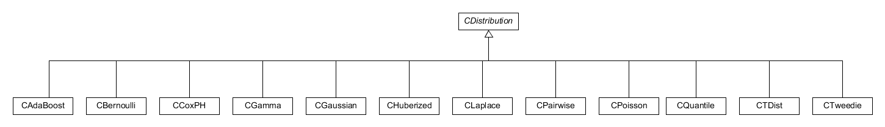
**Figure 6.** Diagram showing the distributions currently implemented within the system.

The construction of the a distribution object is done using a dynamic factory pattern, see Figure 7.  In this design, the constructors of the concrete distribution classes are private and they contain a static `Create` method.  This method is registered to a map in the factory, `distribution_factory.cpp`, where the name of the distribution, a string, is its key.  On creation of a gbm engine object, a distribution factory is created and the appropriate distribution is generated from the factory using the user selected distribution, a string which acts as key to the same map, and `DataDistParams` struct.

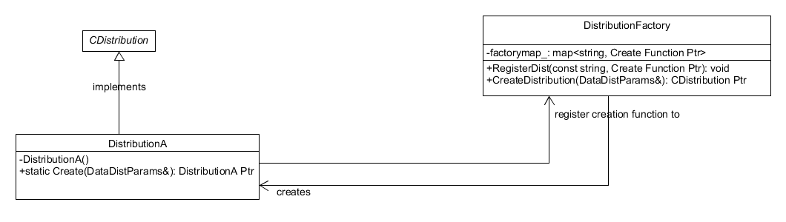
**Figure 7.** Dynamic Factory pattern used to control the creation of distribution objects. The distribution factory itself is a singleton.

To conclude this subsection, there are some concrete distribution specific details to describe.  The pairwise distribution, `CPairwise.h`, uses several objects which specify the information ratio measure that this distribution uses in its implementation.  These classes all inherit from an abstract `IRMeasure` class and are defined in the `CPairwise.h` and `CPairwise.cpp` files.

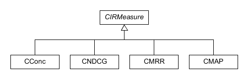
**Figure 8.** Diagram displaying the information ratio classes used by the pairwise distribution.

The other distribution which has a unique design is the Cox partial hazards model.  The Cox partial hazards model is a survival model whose implementation depends on whether the response matrix provided to the system is that of "censored" data or "start-stop" data.  In essence, if the response matrix has 2 columns it is censored and if it has more than 2 it is start-stop.  To incorporate this added complexity, the `CCoxPH.h` class follows a state pattern, whereby the Cox PH object contains a pointer to an object implementing the correct methods for a specific scenario and those objects contain a pointer to the Cox PH object.  This design is shown in Figure 9.

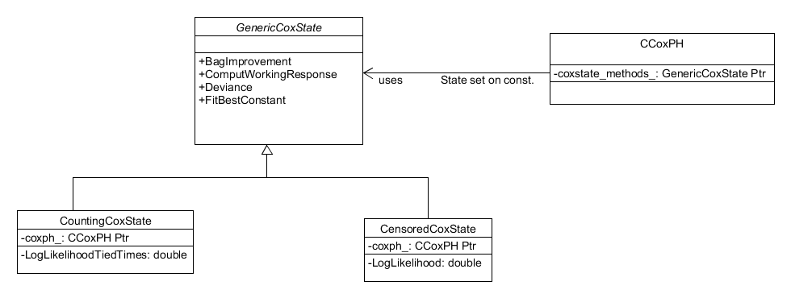
**Figure 9.** The Cox Partial Hazards distribution employs a state design pattern to accommodate the dependency of its implementation on the response matrix.

## 2.3.4 - Trees and Nodes
The final component of the gbm engine to consider is the tree class defined in `tree.h`. As described in Section 2.1 the tree class contains: a rootnode, of class `CNode`, a vector of pointers to terminal nodes, a vector assigning data to those terminal nodes, a node search object (see `node_searcher.h`) and various data describing the tree (such as its maximum depth etc.).  The tree class has methods that grow the tree, reset it for another growth, prediction on validation data, adjusting the tree once predictions are assigned to the terminal nodes and outputting it in a suitable format for the R layer to use.

The most important part of this class is the method for the growing of the tree. A key component in growing a tree is identifying appropriate splits, this role is the responsibility of the node searcher object. The node searcher object stores the best split identified for each terminal node. It uses vectors of variable splitters (see `vec_varsplitters.h` and `varsplitter.h`) to determine the best splits generated for each node and for each variable.  Within the `GenerateAllSplits()` method, one vector of `NodeParams`, see below, copies the current best splits stored in the node searcher object.  The variables to split on are then looped over and a vector of variable splits, one for each terminal node, is initialized to calculate the best split for the current variable in each node.
The best split for the current variable is extracted from this vector and used to update the copy of the best splits. At the end of this loop, the updated copy of best splits are then assigned to the best splits stored in the node search object. This design follows a MapReduce structure and allows for parallelisation of this search process; the details of this parallelisation (see `parallel_details.h`) are also stored as a private member in the node search class. 

The node class itself contains pointers to its children and its methods, such as calculating predictions, are dependent on the type of split present.  The node can either be terminal, so it has no split, or have a continuous/categorical split.  To account for this dependency on the split, the node class is implemented with a state design pattern , similar to the Cox PH distribution, but in this instance it posseses a `SetStrategy()` method so the implementation of a node can change as a tree grows.  The variable splitter objects contain "node parameters", see `node_parameters.h`, which encapsulate the properties of the proposed split nodes.  These `NodeParams` objects use `NodeDef` structs, located in `node_parameters.h`, to define the proposed node splits and provides methods to evaluate the quality of the proposed splits. Finally, the `varsplitter` class has a state design pattern where on construction the methods for how the variable of interest should be split are set, see Figure 11. 

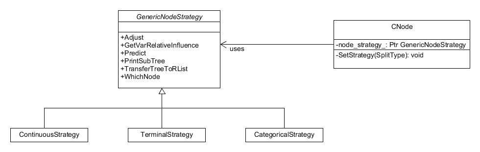
**Figure 10.** State pattern for the node object, it possesses a "SetStrategy()" method so nodes can change type as the tree grows.

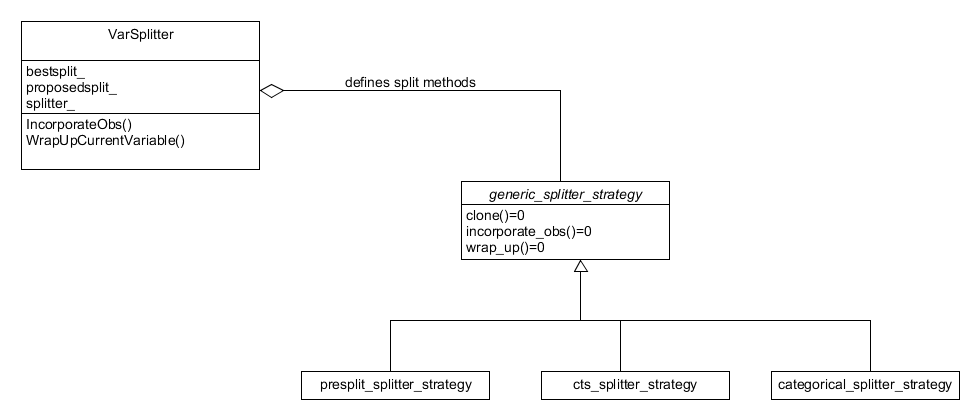
**Figure 11.** State pattern for the variable splitter object.  How it splits on a variable is set on construction.

To conclude this Secion formal system class and interaction diagrams are presented in Figures 12 & 13 repsectively. These provide a complete and more detailed picture of the classes and their interactions which define the system, in particular the process of training a gbm.

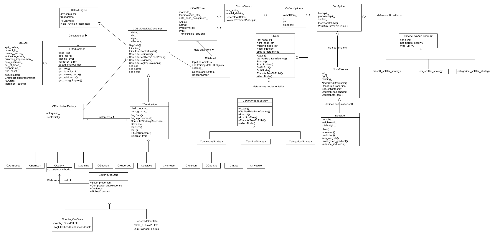
**Figure 12.** System class diagram showing the classes and how they interface in the training method.

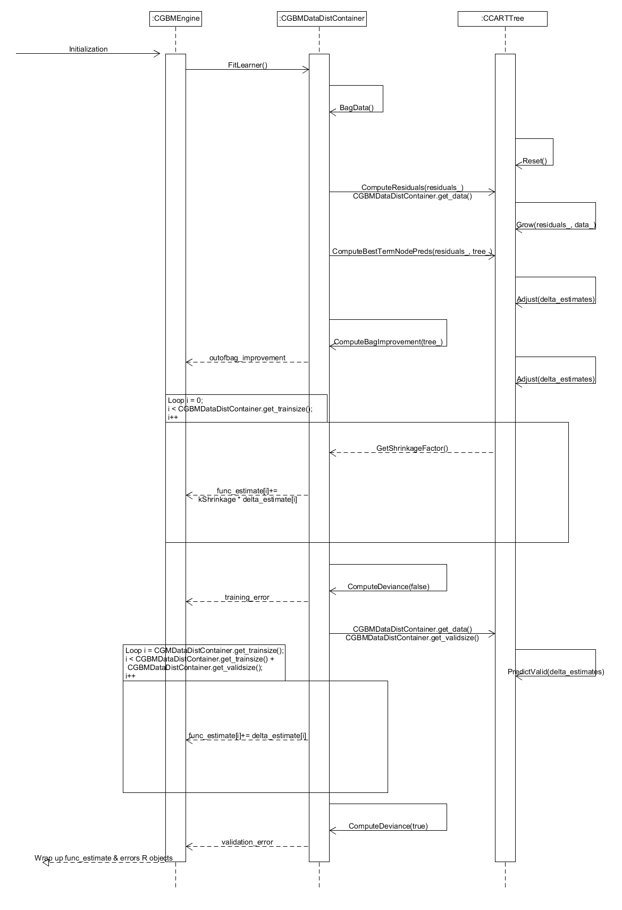
**Figure 13.** Sequence diagram for training a single tree when fitting a gradient boosted model.

## 2.4 - Deployment
To use the GBM package it is necessary to install a version of R on your system, preferably 3.2 or higher.  With R installed, the GBM package may be installed by opening up a R terminal and using the `install.packages("gbm")` command to install the package.

# 3 - Testing
The system is subject to two types of testing: black-box system and acceptance tests and unit testing.  These tests are designed to run with the `testthat` package and ship with the GBM package in `/tests/` folder. The package can be checked using ` R CMD check <built package>` which will automatically run all of the tests within it and report any warnings or errors. 

## 3.1 - Current Coverage
Currently the system has a series of black box system tests which check that the package is operating as expected using what can be considered 'sanity test cases' as well testing for errors.  These tests focus primarily on the Gaussian, Bernoulli and CoxPH distributions at this time.  Some tests, such as the checking the effects of the offset, touch all distributions implemented in the system.  Using the `covr` package, the travis CI server automatically collects code coverage data and sends it to `codecov.io`.  As of 03/06/2016 this coverage is at 66.07%, with a coverage of the R layer at 42.15% and coverage of the system at 79.28%.

This coverage tool is not perfect and when measuring exercisation of inlined code it is likely to say that the inlined functionality has been missed when in fact it has been exercised.  Beyond this the tests do not exercise the counting Cox PH functionality, misses node functionality such as `PrintSubTree` and `GetVarRelativeInfluence`, does not touch many unhappy paths/error throwing paths and completely misses the `gbm_plot` functionality.  That being said, even with only the higher level black-box testing in place most of the important paths within the system are exercised. By contrast the R layer has a few well tested pieces of functionality, such as `gbm.fit.R`, but a large number of functions have no coverage at all.

Finally, the system itself can now be tested using R's `testthat` package thanks to a recent update.  These unit tests have yet to be written.
